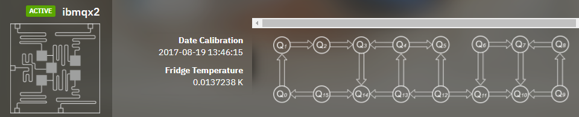

# CODING CHALLANGE WINNER!

## Coding Challenge

This week's coding challenge is to implement a **Quantum Computing Algorithm** with the IBM QISKIT API. By <a href="https://github.com/llSourcell/The_Math_of_Intelligence">Siraj Raval.</a>
The submission file is "QuantumComputing - Bell State Tomography.ipynb"

# Review

# Quantum Computing

## Bell State Tomography

### Introduction - Theoretical background

#### Bell state: 
The **Bell states** are a concept in quantum information science and represent the **simplest examples of entanglement**. [...] An EPR pair is a **pair of qubits** (or quantum bits) that are in a Bell state together, that is, **entangled with each other.** Unlike classical phenomena such as the nuclear, electromagnetic, and gravitational fields, entanglement is invariant under distance of separation[dubious – discuss] and is not subject to relativistic limitations such as the speed of light (though the no-communication theorem prevents this behaviour being used to transmit information faster than light, which would violate causality). [1]

#### Quantum state tomography:
Quantum state tomography is the **process** by which an **identical ensemble
of unknown quantum states is completely characterized.** A sequence of
identical measurements within a series of different bases allow the reconstruction
of a complete quantum wavefunction. [2]

#### IBMQX2:
It's a 5 Qubit real processor hosted at IBM, in which we could do our Quantum Computing experiments, pretty awesome.

#### Philosophy:
The basic concept of our quantum program is an array of quantum circuits. The program workflow consists of three stages: Build, Compile, and Run. Build allows you to make different quantum circuits that represent the problem you are solving; Compile allows you to rewrite them to run on different backends (simulators/real chips of different quantum volumes, sizes, fidelity, etc); and Run launches the jobs. After the jobs have been run, the data is collected. There are methods for putting this data together, depending on the program. This either gives you the answer you wanted or allows you to make a better program for the next instance. [3]
 

## Dependencies for challenge

* numpy
* QISKIT

## Dependencies for Full Notebook

* matplotlib (for plotting)
* scipy (linear algebra)

### References

<a href="https://www.youtube.com/watch?v=LhtnECml-KI">Siraj Raval - Youtube - Quantum Computing - The Math of Intelligence #10</a>